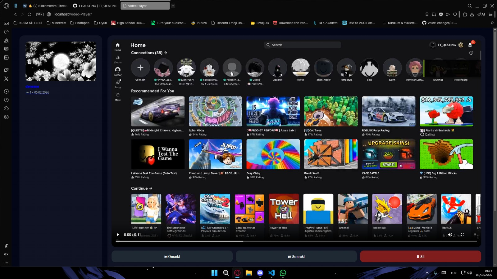

# 🎬 PHP Video Player & Manager

A simple, modern, and lightweight **PHP-based video player and manager**.  
Videos are displayed in a **fixed 16:9 player**, with a clean UI, sidebar playlist, and built-in upload system.

This project does **not** require a database — everything is stored in a JSON file.

---

## ✨ Features

- 🎥 Fixed **16:9 video player** (no resolution jumping)
- 📂 Upload videos and thumbnails
- 🖼 Thumbnail-based sidebar playlist
- ⏮ Previous / ⏭ Next navigation
- 👁 View counter (cookie-based, per user)
- 🗑 Delete videos safely
- 🎨 Modern dark UI
- ⚡ No database required (JSON storage)
- 🧩 Simple & beginner-friendly PHP structure

---

## 📁 Project Structure

```
Video-Player/
│
├─ index.php        # Main page & player
├─ upload.php       # Upload handler
├─ delete.php       # Delete handler
├─ data.json        # Video data storage
├─ style.css        # UI styles
│
├─ videos/          # Uploaded videos
└─ thumbnails/      # Video thumbnails
```

---

## 🚀 Installation

1. Clone or download the repository
2. Upload the project to a PHP-supported server (Apache / Nginx / XAMPP)
3. Make sure these folders are writable:
   - `videos/`
   - `thumbnails/`
   - `data.json`
4. Open `index.php` in your browser

✅ No database setup required

---

## 🧪 Requirements

- PHP 7.4 or newer
- Web server (Apache, Nginx, XAMPP, etc.)
- Browser with HTML5 video support

---

## 📸 Screenshots

> You can add screenshots here to showcase the UI  
> Example:
> 

---

## 🔒 Notes

- This project does **not** include authentication or admin login
- Designed for **personal projects, demos, or small sites**
- File uploads are basic — add validation if used publicly

---

## 🛠 Possible Improvements

- Search & filter videos
- Mobile-first responsive layout
- Video duration display
- Admin login & permissions
- Drag & drop upload
- Video categories

---

## 📜 License

This project is open-source and free to use.  
You are free to modify and improve it for your own needs.

---

## ❤️ by TT_QESTING

Made with care for learning and simplicity.  
If you improve it — feel free to share or fork 🚀
