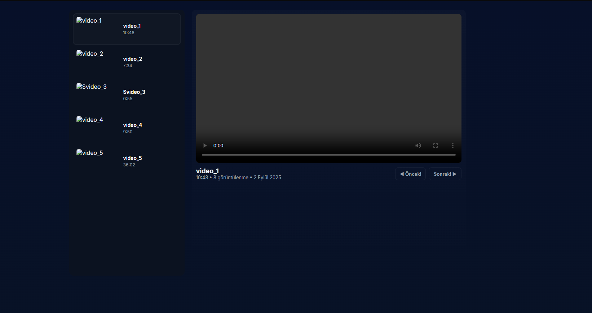

# 🎬 Custom Video Player

A modern, responsive **video player web app** built with pure **HTML, CSS, and JavaScript**.  
It features a dynamic playlist, local view counters, and a clean YouTube-like UI.

---

## ✨ Features
- 📂 **Playlist support** — easily add your videos in `playlist` array
- 🎞 **Thumbnails** — auto-generated video list with preview images
- ⏱ **Video duration & date** displayed
- 👀 **Local view counter** — each play increases views (stored in browser `localStorage`)
- ▶️ **Auto play next** when a video ends
- 📱 **Responsive design** — works on desktop & mobile
- 🎨 Modern dark UI with hover effects and smooth styling

---

## 🖼 Preview
  

---

## 🚀 Getting Started

Clone the repository:
```bash
git clone https://github.com/TT_QESTING/video-player.git
cd video-player
